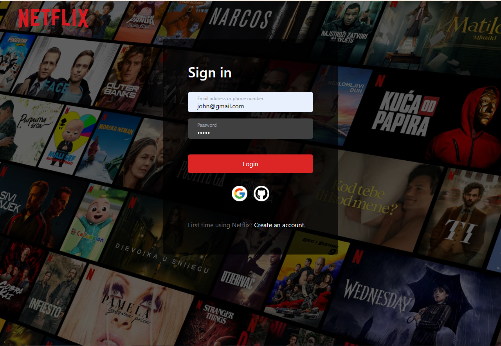
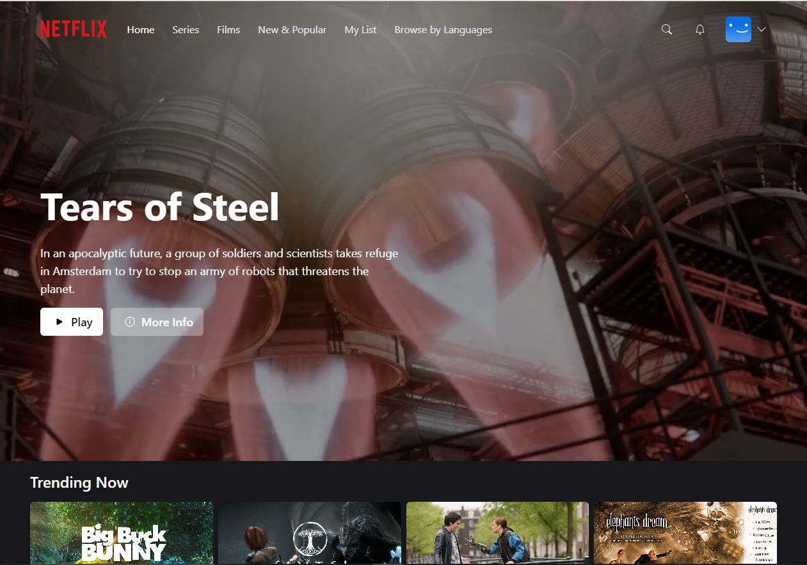

# Netflix Clone App

A full-stack Netflix clone built with **Next.js**, **React**, **TypeScript**, **Prisma**, and **MongoDB**. It supports user authentication, browsing movies, watching videos, managing a personal favourites list, and searching content.

---

## Screenshots

### Login Page


### Home / Browse


---

## Features

- 🔐 **Authentication** – Register, log in, and log out with credentials via NextAuth.js
- 🎬 **Browse Movies** – Billboard hero section and categorised movie carousels
- ▶️ **Watch Videos** – Full-screen video player for each movie
- ❤️ **My List** – Add or remove movies from a personal favourites list
- 🔍 **Search** – Search movies by title or genre
- 📺 **Series View** – Dedicated series browsing page
- 👤 **Profile Selection** – Multi-profile selection screen
- 📱 **Responsive Design** – Mobile-friendly UI powered by Tailwind CSS

---

## Tech Stack

| Layer | Technology |
|---|---|
| Framework | [Next.js 13](https://nextjs.org/) |
| Language | TypeScript |
| Styling | Tailwind CSS |
| Animation | Framer Motion |
| Auth | NextAuth.js |
| ORM | Prisma |
| Database | MongoDB |
| State | Zustand + SWR |
| Icons | Heroicons, React Icons |

---

## Getting Started

### Prerequisites

- Node.js ≥ 18
- A MongoDB connection string (e.g. MongoDB Atlas)

### Installation

```bash
# 1. Clone the repository
git clone https://github.com/Husnain192/NeftlixCloneApp.git
cd NeftlixCloneApp/netflix-clone-app

# 2. Install dependencies
npm install

# 3. Configure environment variables
cp .env.example .env.local
# Fill in the values described in the section below

# 4. Push the Prisma schema to your database
npx prisma db push

# 5. Start the development server
npm run dev
```

Open [http://localhost:3000](http://localhost:3000) in your browser.

### Environment Variables

Create a `.env.local` file inside `netflix-clone-app/` with the following keys:

```env
DATABASE_URL=mongodb+srv://<user>:<password>@cluster.mongodb.net/netflix
NEXTAUTH_URL=http://localhost:3000
NEXTAUTH_SECRET=your_nextauth_secret
```

---

## Project Structure

```
netflix-clone-app/
├── components/       # Reusable UI components (Navbar, Billboard, MovieCard, …)
├── hooks/            # Custom SWR data-fetching hooks
├── lib/              # Prisma client and utility helpers
├── pages/            # Next.js file-based routes + API routes
│   └── api/          # REST API handlers (auth, movies, favourites, …)
├── prisma/
│   └── schema.prisma # Database schema (User, Movie, Session, …)
├── public/           # Static assets
├── styles/           # Global CSS
└── types/            # Shared TypeScript types
```

---

## Available Scripts

| Command | Description |
|---|---|
| `npm run dev` | Start the development server |
| `npm run build` | Build for production |
| `npm run start` | Start the production server |
| `npm run lint` | Run ESLint |

---

## License

This project is for educational purposes only and is not affiliated with or endorsed by Netflix.

